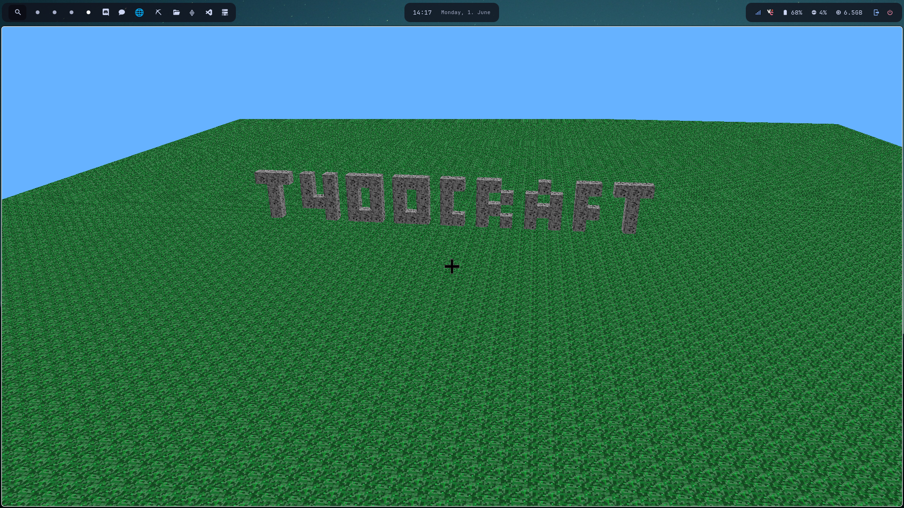
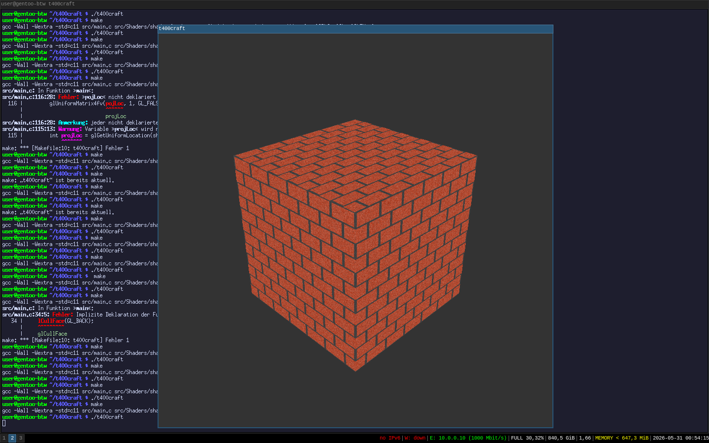
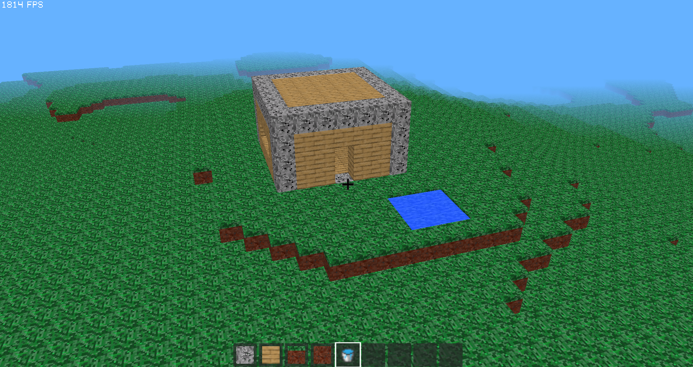

# t400craft



## About the Project

This project exists because I own an old **ThinkPad T400**. Even older versions of Minecraft do not run particularly well on it anymore. Since I still wanted to play a block-based sandbox game on that hardware, I decided to write my own from scratch using **C** and **OpenGL**.

The goal of **t400craft** is to create a lightweight voxel game that can run on extremely old or low-end hardware while remaining fun to play and easy to modify.

## Requirements

The project is intentionally kept simple and has very few dependencies.

Required:

- GLEW

You will also need a C compiler.

## Compiling and Running

Simply run the following commands in the root directory of the project:

```bash
make
./t400craft
```

## Development Timeline & Screenshots

Here is a little insight into the development process and how the project evolved.

### The Very First Steps


*I tried making a block, but it didn't work that well.*

### The First Real Success



*The first time I had an actual block.*

### Implementing Mechanics


*The first time I implemented a building mechanic.*

### a little House with some water



*Here you can see some rudimentary water mechanics, aswell as an automatically generated world and a house I built.*